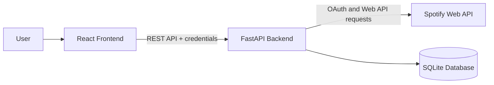
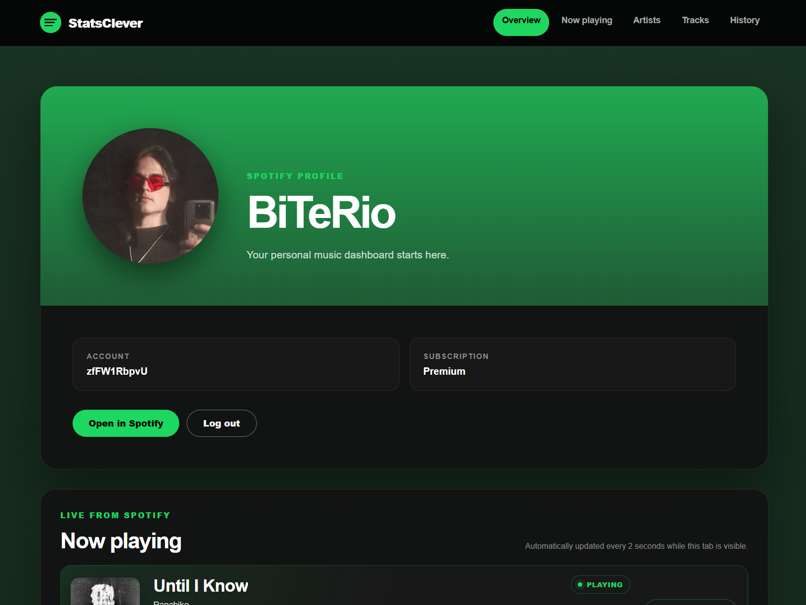
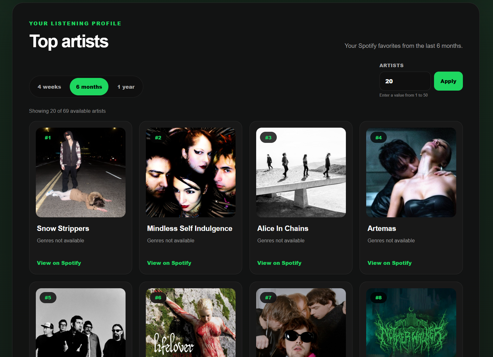
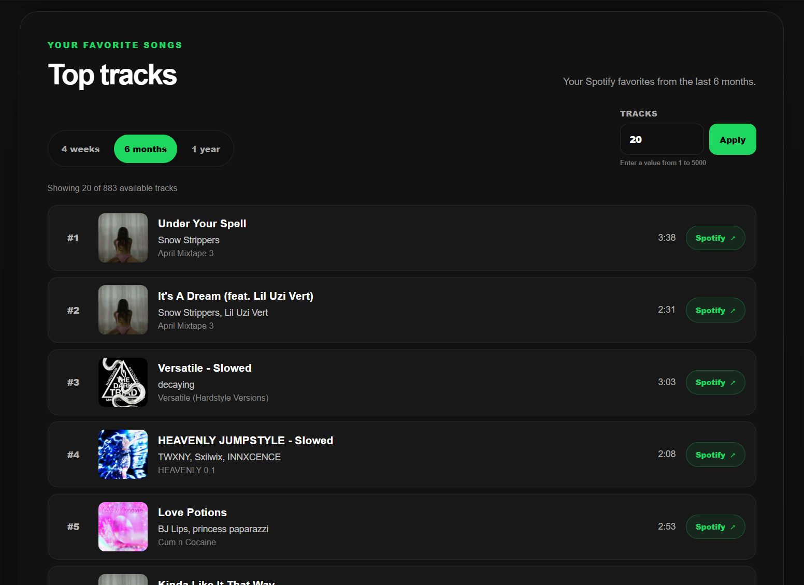
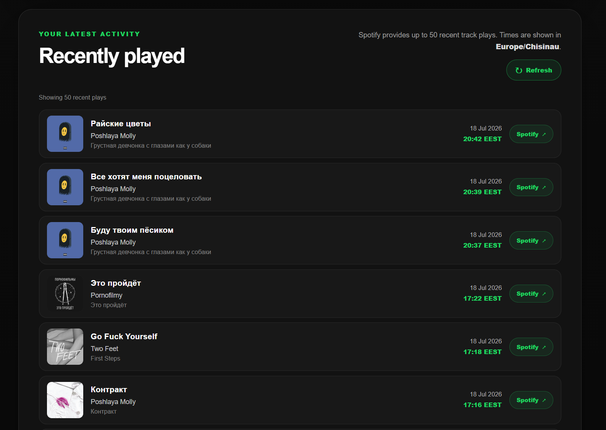
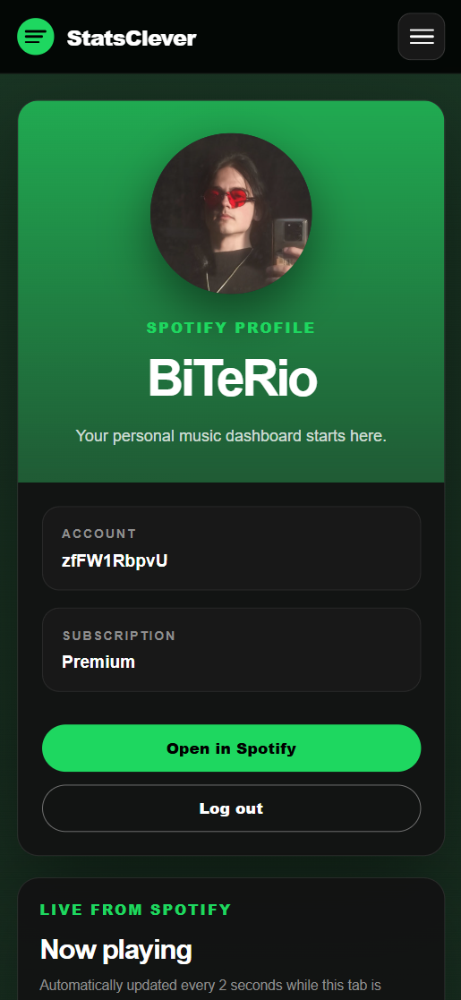

<div align="center">

# StatsClever

### A full-stack personal listening dashboard powered by the Spotify Web API

[](https://react.dev/)
[](https://www.typescriptlang.org/)
[](https://fastapi.tiangolo.com/)
[](https://www.python.org/)
[](https://www.docker.com/)
[](https://www.sqlite.org/)

StatsClever lets users securely connect their Spotify account and explore their profile, favorite artists, favorite tracks, recent listening activity, and current playback state in a responsive dashboard.

</div>

> **Note:** StatsClever is an independent portfolio project. It is not affiliated with, endorsed by, or sponsored by Spotify.

## Overview

StatsClever is a local-first full-stack web application built to demonstrate practical frontend and backend development with third-party OAuth integration.

The React frontend communicates only with the FastAPI backend. Spotify credentials, access tokens, refresh tokens, API requests, session management, response transformation, and error handling remain on the server.

## Features

- Spotify OAuth 2.0 Authorization Code Flow
- Secure server-side token handling
- Persistent authentication with HttpOnly cookies
- Hashed application session tokens
- Automatic Spotify access-token refresh
- Spotify profile information and profile links
- Top artists for three Spotify time ranges
- Top tracks with configurable result limits
- Recently played tracks with local date and time formatting
- Current playback status with automatic polling
- Responsive desktop and mobile interface
- Skeleton loading states
- Empty states and user-friendly error messages
- Centralized notification system
- Custom 404 page
- Interactive FastAPI Swagger documentation
- Docker Compose setup for frontend and backend
- Built-in test scenarios for API error and empty-state handling

## Technology Stack

### Frontend

- React 19
- TypeScript 6
- Vite 8
- React Router
- Fetch API
- CSS
- Oxlint

### Backend

- Python 3.14
- FastAPI
- Pydantic
- SQLAlchemy Async
- HTTPX
- Uvicorn
- SQLite with `aiosqlite`

### Infrastructure

- Docker
- Docker Compose
- Git and GitHub

## Architecture



The frontend never communicates with Spotify directly.

The backend is responsible for:

- OAuth authorization and callback validation;
- Spotify token exchange and refresh;
- application session creation and validation;
- Spotify Web API requests;
- data validation and transformation;
- centralized error handling;
- local persistence of users, tokens, and sessions.

## Screenshots

Screenshots will be added to the repository before the `v1.0.0` portfolio release.

Recommended locations:

```text
docs/screenshots/dashboard.png
docs/screenshots/top-artists.png
docs/screenshots/top-tracks.png
docs/screenshots/history.png
docs/screenshots/mobile.png
```

<!--
After adding the files, replace this comment with:

<p align="center">
  
</p>

| Top artists | Top tracks |
| --- | --- |
|  |  |

| Recent history | Mobile layout |
| --- | --- |
|  |  |
-->

## Project Structure

```text
statsclever/
├── backend/
│   ├── app/
│   │   ├── api/             # FastAPI route handlers
│   │   ├── core/            # Configuration and security helpers
│   │   ├── middleware/      # Test-response middleware
│   │   ├── models/          # SQLAlchemy database models
│   │   ├── schemas/         # Pydantic request and response schemas
│   │   ├── services/        # Spotify and application business logic
│   │   ├── database.py
│   │   └── main.py
│   ├── .env.example
│   ├── Dockerfile
│   └── requirements.txt
│
├── frontend/
│   ├── public/
│   ├── src/
│   │   ├── api/             # Backend API clients
│   │   ├── components/      # Reusable UI components
│   │   ├── config/          # Frontend environment configuration
│   │   ├── contexts/        # Notification context
│   │   ├── layouts/         # Shared application layout
│   │   ├── pages/           # History and 404 pages
│   │   ├── types/           # Shared TypeScript types
│   │   ├── utils/           # Formatting and error helpers
│   │   ├── App.tsx
│   │   └── main.tsx
│   ├── .env.example
│   ├── Dockerfile
│   └── package.json
│
├── docker-compose.yml
├── .gitignore
└── README.md
```

## Getting Started with Docker

Docker Compose is the recommended way to run the project.

### Prerequisites

- Git
- Docker Desktop or Docker Engine with Docker Compose
- A Spotify Developer application

### 1. Clone the repository

```bash
git clone https://github.com/YOUR_USERNAME/statsclever.git
cd statsclever
```

Replace `YOUR_USERNAME` with your GitHub username.

### 2. Configure the Spotify application

Create an application in the Spotify Developer Dashboard and add this redirect URI:

```text
http://127.0.0.1:8000/api/auth/callback
```

Use the exact same URI in both Spotify settings and the backend environment file. Do not replace `127.0.0.1` with `localhost` unless every related setting is changed consistently.

The application requests these Spotify scopes:

```text
user-read-private
user-top-read
user-read-recently-played
user-read-currently-playing
user-read-playback-state
```

### 3. Create environment files

PowerShell:

```powershell
Copy-Item backend/.env.example backend/.env
Copy-Item frontend/.env.example frontend/.env
```

macOS or Linux:

```bash
cp backend/.env.example backend/.env
cp frontend/.env.example frontend/.env
```

Open `backend/.env` and provide your Spotify credentials:

```env
SPOTIFY_CLIENT_ID=your_spotify_client_id
SPOTIFY_CLIENT_SECRET=your_spotify_client_secret
SPOTIFY_REDIRECT_URI=http://127.0.0.1:8000/api/auth/callback
```

The frontend configuration should contain:

```env
VITE_API_BASE_URL=http://127.0.0.1:8000
```

Never commit either `.env` file.

### 4. Start the application

```bash
docker compose up --build
```

After both containers start, open:

| Service | URL |
| --- | --- |
| Frontend | `http://127.0.0.1:5173` |
| Backend | `http://127.0.0.1:8000` |
| Swagger UI | `http://127.0.0.1:8000/docs` |
| Health check | `http://127.0.0.1:8000/api/health` |

### 5. Stop the application

```bash
docker compose down
```

The SQLite database is created automatically inside the `backend` directory and is ignored by Git.

## Running without Docker

### Backend

Requirements:

- Python 3.14

```bash
cd backend
python -m venv .venv
```

Activate the environment in PowerShell:

```powershell
.\.venv\Scripts\Activate.ps1
```

Activate it on macOS or Linux:

```bash
source .venv/bin/activate
```

Install dependencies and start FastAPI:

```bash
python -m pip install --upgrade pip
python -m pip install -r requirements.txt
python -m uvicorn app.main:app --reload --host 127.0.0.1 --port 8000
```

### Frontend

Requirements:

- Node.js 22+
- npm

In a second terminal:

```bash
cd frontend
npm ci
npm run dev
```

## Available Scripts

From the `frontend` directory:

```bash
npm run dev      # Start the Vite development server
npm run lint     # Run Oxlint
npm run build    # Type-check and create a production build
npm run preview  # Preview the production build locally
```

## API Endpoints

| Method | Endpoint | Description |
| --- | --- | --- |
| `GET` | `/api/health` | Check backend health |
| `GET` | `/api/auth/login` | Start Spotify authorization |
| `GET` | `/api/auth/callback` | Complete Spotify authorization |
| `GET` | `/api/auth/session` | Read the current application session |
| `POST` | `/api/auth/logout` | Revoke the current application session |
| `GET` | `/api/me` | Get the authenticated Spotify profile |
| `GET` | `/api/stats/top-artists` | Get top artists by time range |
| `GET` | `/api/stats/top-tracks` | Get top tracks by time range |
| `GET` | `/api/history/recent` | Get recently played tracks |
| `GET` | `/api/player/current` | Get current playback state |

Example:

```text
GET /api/stats/top-artists?time_range=medium_term&limit=20
```

Supported time ranges:

- `short_term` — approximately the last 4 weeks;
- `medium_term` — approximately the last 6 months;
- `long_term` — approximately the last year.

## Test Scenarios

The backend includes middleware for testing frontend empty and error states without waiting for a real Spotify API failure.

Configure `backend/.env`:

```env
APP_ENVIRONMENT=testing
TEST_API_TARGET=top-artists
TEST_API_SCENARIO=empty
```

Available targets:

```text
me
top-artists
top-tracks
history
player
```

Available scenarios:

```text
empty
401
403
429
500
```

Return to normal API behavior after testing:

```env
APP_ENVIRONMENT=development
TEST_API_TARGET=none
TEST_API_SCENARIO=none
```

Restart the backend after changing environment values.

## Security Notes

- The Spotify Client Secret is stored only on the backend.
- Spotify tokens are never exposed to the React application.
- OAuth state is generated securely and validated during the callback.
- Application sessions use random tokens stored in HttpOnly cookies.
- Only SHA-256 hashes of application session tokens are stored in SQLite.
- `.env`, SQLite databases, build output, dependencies, and Python cache files are excluded through `.gitignore`.
- Production use would additionally require HTTPS, secure cookies, encrypted Spotify tokens, and production-grade secret management.

## Data and API Limitations

- Top artists and tracks are Spotify preference rankings, not exact play counts.
- Recently played data is limited to the history currently exposed by the Spotify Web API.
- StatsClever does not provide a complete historical archive of a Spotify account.
- The current version does not play music or control Spotify playback.
- Local data begins fresh when the SQLite database is deleted.

## Roadmap

- Automated backend tests
- Frontend component and end-to-end tests
- GitHub Actions for linting and builds
- PostgreSQL configuration for production environments
- Database migrations
- Improved accessibility testing
- Optional self-hosted deployment configuration

## Acknowledgements

This project uses the Spotify Web API. Album artwork, artist images, track metadata, and Spotify links are provided by Spotify.

Spotify is a trademark of Spotify AB.
